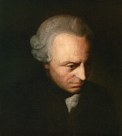

# KL_1 in Agda

**KL_1** is a non-classical logic by R. Evans, M.Sergot and A.Stephenson, which formalizes **cognitive acts** as the basic units of inference. Developed to model Kant’s conception of rules in the *Critique of Pure Reason*, KL1 treats rules as **procedures** for generating acts (such as *subsumptions*) conditionally on other acts.
KL_1 does not assume that atoms have truth values. Instead, it captures the structure of norm-governed mental activity and models how an agent constructs a coherent representation of the world by applying rules to acts—such as perceiving, subsuming, or identifying patterns in sensory input.
KL_1 is part of a broader formal architecture (KL_1–KL_3) for modeling Kantian cognition computationally.

This implementation follows as closely as possible the syntax and semantics described in Section 3.2 of the following paper:  
[Formalizing Kant’s Rules: A Logic of Conditional Imperatives and Permissives (Evans, Sergot, Stephenson)](https://link.springer.com/article/10.1007/s10992-019-09531-x)
